# Deteksi Jalur Jalan pada Video Menggunakan MATLAB

Proyek ini berisi implementasi deteksi jalur jalan (*lane detection*) pada video menggunakan MATLAB. Program membaca video input, mendeteksi garis marka jalan pada setiap frame, menstabilkan hasil deteksi agar tidak mudah berkedip, lalu menyimpan video output beserta gambar panel proses untuk satu frame contoh.

## Fitur Utama

- Membaca video input menggunakan `VideoReader`.
- Mengubah frame RGB ke grayscale.
- Mengurangi noise menggunakan Gaussian blur.
- Mendeteksi tepi menggunakan metode Canny.
- Membatasi area pemrosesan dengan Region of Interest (ROI).
- Mendeteksi kandidat garis menggunakan Hough Transform.
- Memisahkan garis jalur kiri dan kanan berdasarkan kemiringan.
- Melakukan fitting garis agar hasil deteksi lebih rapi.
- Menambahkan stabilizer untuk mengurangi efek garis muncul-hilang antar frame.
- Menyimpan hasil akhir dalam bentuk video `.mp4`.
- Menyimpan panel visualisasi alur proses untuk satu frame.

## Struktur File

| File | Keterangan |
| --- | --- |
| `code.m` | Program utama deteksi jalur jalan. |
| `video.mp4` | Video input yang akan diproses. File ini tidak disertakan di repository karena masuk `.gitignore`. |
| `video_lane_output.mp4` | Video hasil deteksi jalur. File ini akan dibuat setelah program dijalankan dan tidak disertakan di repository. |
| `proses_1_frame_lane_detection.png` | Gambar panel tahapan proses pada satu frame. |
| `readme.md` | Dokumentasi proyek. |

## Contoh Video

Pada contoh kasus proyek ini, video input dan video output dapat dilihat melalui tautan berikut:

| Jenis Video | Tautan |
| --- | --- |
| Video input | [Google Drive - video.mp4](https://drive.google.com/file/d/1mJj8Vhi2tczT316UMwXE_9T9-mGWTJaL/view?usp=sharing) |
| Video output | [Google Drive - video_lane_output.mp4](https://drive.google.com/file/d/1vru8lWypsxkBeOKi1gVeVgc0XKkHm6er/view?usp=sharing) |

## Kebutuhan Sistem

Program ini dijalankan menggunakan MATLAB dan membutuhkan toolbox berikut:

- Image Processing Toolbox
- Computer Vision Toolbox

Beberapa fungsi yang digunakan antara lain:

- `VideoReader`
- `VideoWriter`
- `rgb2gray`
- `imgaussfilt`
- `edge`
- `poly2mask`
- `hough`
- `houghpeaks`
- `houghlines`
- `insertShape`
- `exportgraphics`

## Cara Menjalankan Program

1. Siapkan file video input dengan nama `video.mp4` di folder yang sama dengan `code.m`.
2. Buka MATLAB.
3. Arahkan *Current Folder* MATLAB ke folder proyek ini.
4. Jalankan file:

```matlab
code
```

Setelah program selesai, MATLAB akan menampilkan pesan seperti berikut:

```text
Selesai!
Video output disimpan sebagai: video_lane_output.mp4
Panel proses 1 frame disimpan sebagai: proses_1_frame_lane_detection.png
```

## Output Program

Program menghasilkan dua file utama:

| Output | Keterangan |
| --- | --- |
| `video_lane_output.mp4` | Video dengan garis deteksi jalur kiri dan kanan. |
| `proses_1_frame_lane_detection.png` | Panel berisi tahapan pemrosesan untuk satu frame contoh. |

Pada video output:

- Garis biru menunjukkan jalur kiri.
- Garis merah menunjukkan jalur kanan.
- Area hijau transparan menunjukkan area jalur yang berhasil dideteksi.

## Alur Pemrosesan

Program memproses setiap frame video dengan tahapan berikut:

1. Mengambil frame asli dari video.
2. Mengubah frame RGB menjadi grayscale.
3. Menerapkan Gaussian blur untuk mengurangi noise.
4. Mendeteksi tepi menggunakan Canny edge detection.
5. Membuat ROI agar deteksi hanya fokus pada area jalan.
6. Menerapkan Hough Transform untuk mencari kandidat garis.
7. Memfilter garis berdasarkan sudut dan arah kemiringan.
8. Memisahkan garis kiri dan kanan.
9. Melakukan fitting garis untuk membentuk garis jalur yang utuh.
10. Menstabilkan garis antar frame menggunakan metode smoothing.
11. Menggambar hasil deteksi pada frame video.
12. Menyimpan frame hasil ke video output.

### Flowchart

```mermaid
flowchart LR
    A([Mulai]) --> B[Siapkan video.mp4]
    B --> C[Inisialisasi VideoReader<br/>dan VideoWriter]
    C --> D{Masih ada frame?}

    D -- Ya --> E

    subgraph P1[Preprocessing Frame]
        direction TB
        E[Baca frame] --> F[RGB ke grayscale]
        F --> G[Gaussian blur]
        G --> H[Canny edge detection]
    end

    subgraph P2[Deteksi Area Jalan]
        direction TB
        I[Buat ROI] --> J[Ambil edge<br/>di dalam ROI]
    end

    subgraph P3[Deteksi dan Fitting Garis]
        direction TB
        K[Hough Transform] --> L[Hough peaks<br/>dan Hough lines]
        L --> M[Filter garis<br/>berdasarkan sudut]
        M --> N[Pisahkan garis<br/>kiri dan kanan]
        N --> O[Fitting garis jalur]
    end

    subgraph P4[Output Per Frame]
        direction TB
        P[Stabilisasi garis<br/>dengan smoothing] --> Q[Gambar garis<br/>dan area jalur]
        Q --> R[Simpan frame<br/>ke video output]
        R --> S{Frame contoh?}
        S -- Ya --> T[Simpan panel proses<br/>ke PNG]
        S -- Tidak --> U[Lanjut frame berikutnya]
        T --> U
    end

    H --> I
    J --> K
    O --> P
    U --> D

    D -- Tidak --> V[Tutup VideoWriter]
    V --> W[video_lane_output.mp4<br/>proses_1_frame_lane_detection.png]
    W --> X([Selesai])
```



## Parameter Penting

Parameter utama dapat diubah pada bagian `PARAMETER DETEKSI` dan `PARAMETER ROI` di dalam `code.m`.

### Parameter Deteksi

| Parameter | Fungsi |
| --- | --- |
| `param.minAngle` | Sudut minimum garis yang dianggap valid. |
| `param.maxAngle` | Sudut maksimum garis yang dianggap valid. |
| `param.numPeaks` | Jumlah puncak maksimum pada Hough Transform. |
| `param.houghThresh` | Ambang batas puncak Hough. |
| `param.fillGap` | Jarak maksimum untuk menggabungkan segmen garis. |
| `param.minLength` | Panjang minimum garis yang diterima. |
| `param.roiTopRatio` | Posisi batas atas ROI terhadap tinggi frame. |

### Parameter ROI

| Parameter | Fungsi |
| --- | --- |
| `param.bottomLeftRatio` | Posisi titik kiri bawah ROI terhadap lebar frame. |
| `param.bottomRightRatio` | Posisi titik kanan bawah ROI terhadap lebar frame. |
| `param.topLeftRatio` | Posisi titik kiri atas ROI terhadap lebar frame. |
| `param.topRightRatio` | Posisi titik kanan atas ROI terhadap lebar frame. |

## Pengaturan Tampilan

Program menyediakan dua opsi tampilan:

```matlab
showVideoPreview = true;
showProcessFigure = true;
```

Keterangan:

- `showVideoPreview = true` menampilkan video hasil deteksi secara langsung saat proses berjalan.
- `showProcessFigure = true` menampilkan panel tahapan proses untuk satu frame.
- Jika ingin menjalankan program tanpa membuka jendela visualisasi, ubah nilainya menjadi `false`.

## Mengganti Frame Contoh

Panel proses hanya dibuat untuk satu frame tertentu. Nomor frame dapat diubah pada variabel berikut:

```matlab
frameNumber = 30;
```

Jika nilai frame melebihi jumlah frame video, program akan otomatis menyesuaikannya ke frame terakhir yang tersedia.

## Fungsi dalam Program

| Fungsi | Keterangan |
| --- | --- |
| `processLaneFrame` | Memproses satu frame video hingga mendapatkan kandidat garis jalur. |
| `saveProcessPanel` | Membuat dan menyimpan panel visualisasi tahapan proses. |
| `fitLine` | Melakukan fitting garis dari kumpulan titik hasil Hough Transform. |
| `smoothLine` | Menstabilkan garis antar frame agar tidak mudah berkedip. |
| `drawLane` | Menggambar garis kiri, garis kanan, dan area jalur pada frame. |

## Catatan

- Akurasi deteksi sangat dipengaruhi oleh kualitas video, pencahayaan, warna marka jalan, dan posisi kamera.
- Jika garis tidak terdeteksi dengan baik, sesuaikan parameter ROI dan deteksi Hough pada `code.m`.
- File `video.mp4` dan `video_lane_output.mp4` sengaja tidak diikutsertakan ke repository GitHub karena ukuran file video bisa saja besar.
- Program ini cocok digunakan sebagai contoh praktikum pengolahan citra digital, khususnya pada topik deteksi tepi, ROI, Hough Transform, dan pemrosesan video.
